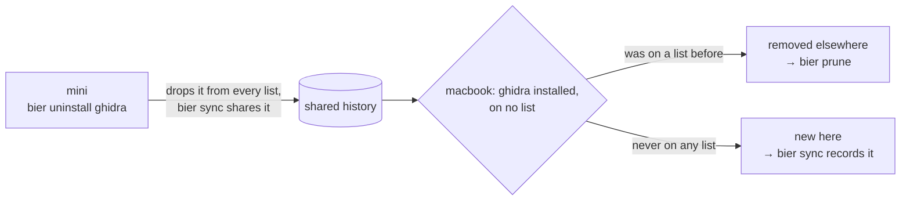

[Docs](../README.md) › Concepts

# How removals travel

A snapshot of what is installed cannot carry a removal across. After you
uninstall something on one Mac, the other Mac simply has it installed
and on no list — exactly the same state as something freshly installed
there.

bier tells the two apart with the one thing a snapshot does not have:
**the git history of the lists.**



- **It used to be on a list and is on none now** — it was removed
  elsewhere. `bier status` shows it with `~`, BierMenu offers *Remove*,
  and [`bier prune`](../using/removing.md) uninstalls it after asking.
- **It was never on any list** — it is new here, shown with `+`, and the
  next `bier sync` records it.

```
Installed on mini but not recorded (bier dump):
  + brew "htop"
Removed on another device, still here (bier prune):
  ~ brew "ghidra"
```

## Safeguards

- **"Removed elsewhere" only counts when the entry is on no list at
  all.** Otherwise a package you picked up from another Mac would look
  like a removal.
- **`bier dump` does not re-record what was removed elsewhere.** A dump
  on the second Mac would otherwise turn the removal into a
  device-specific installation, and it would be lost for good.
  `bier dump --adopt` takes such entries in deliberately, if you want to
  keep the program here after all.
- **bier never uninstalls without asking.** A removal on one Mac becomes
  a suggestion on the others, not an action.

## Known limit

Git merges simultaneous changes to the lists line by line (see
[When two Macs change at once](conflicts.md)). If one Mac removes an entry
while another adds something right next to it, the removed line can come
back. `bier status` then reports it again, and `bier prune` clears it.
