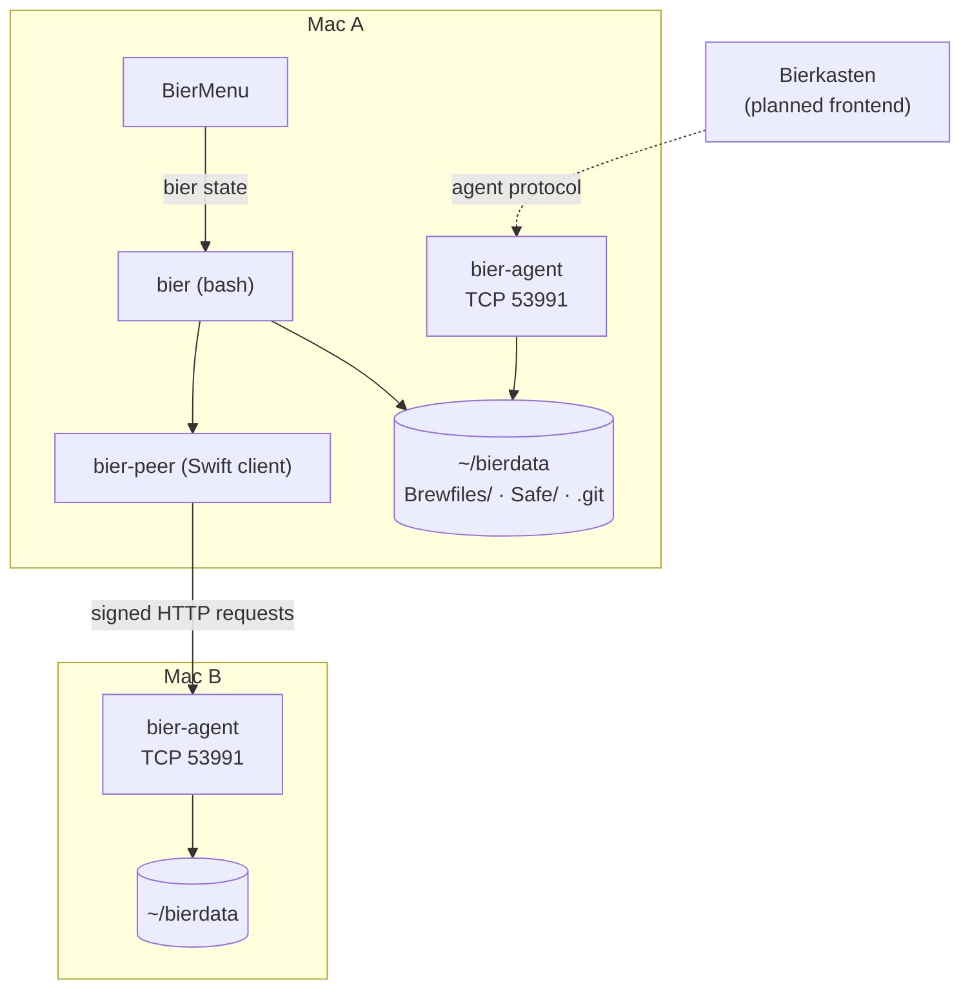
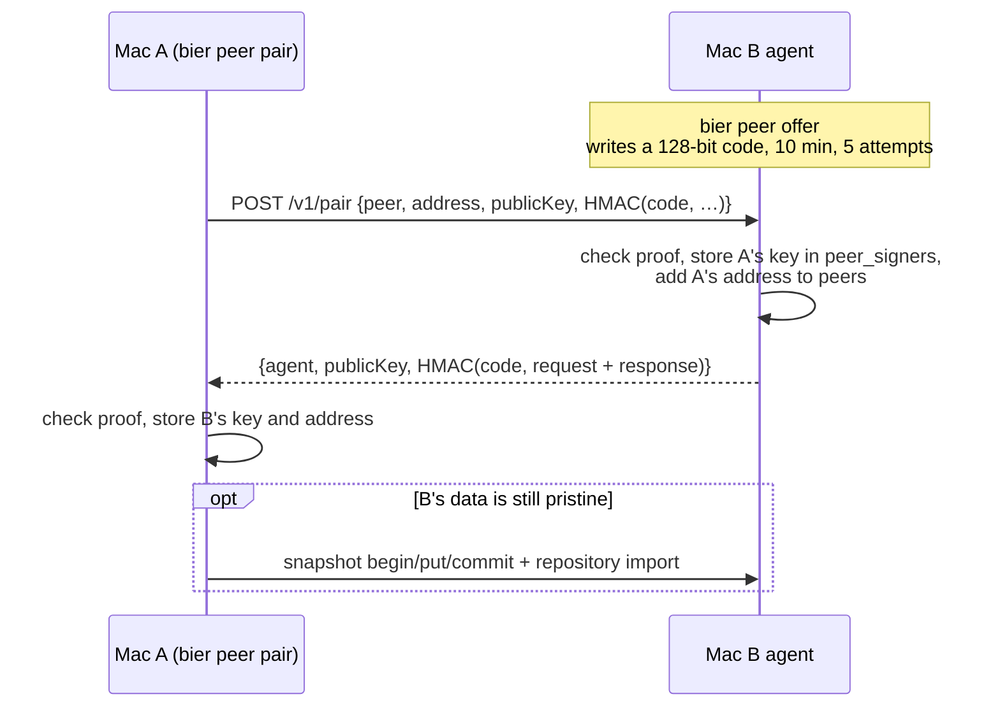
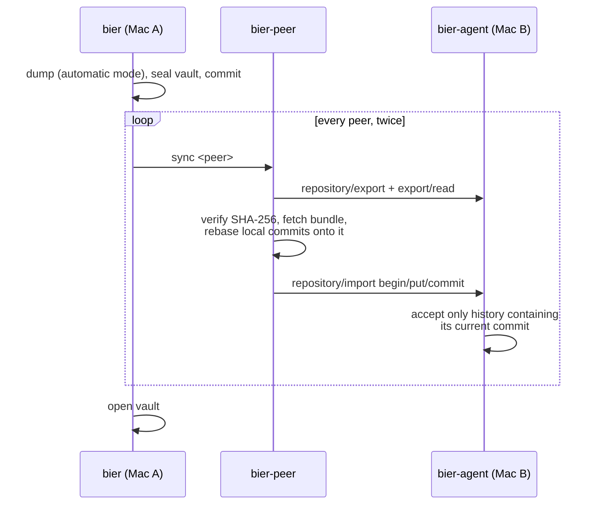

[Docs](../README.md) › Contributing

# System overview: bier, bier-agent and Bierkasten

How the parts fit together, which process owns which data, and where the
trust boundaries run. For the code layout see
[Architecture](architecture.md); for the wire format see the
[peer data protocol](../../Sources/bier-agent/PEER-DATA-PROTOCOL.md).

## The three layers

| Layer | What it is | Repository | Status |
| --- | --- | --- | --- |
| **bier** | the command-line tool: inventory, vault, sync, upgrade | `bierfile` | released |
| **bier-agent** | a small background service on every Mac; the only network endpoint | `bierfile` | released with bier |
| **Bierkasten** | an optional macOS frontend for status, peer overview and recipes | [`bierkasten`](https://github.com/MatthiasToberer/bierkasten) | planned |

The dependency runs one way: Bierkasten talks to the agent, the agent
serves bier's data, and bier works entirely without Bierkasten. The agent
is versioned, built and signed as part of a bier release — Bierkasten
never installs, updates or authorises it.



## Components

### bier — `Sources/bier-core/bier`

A bash script and the single source of truth for inventory logic:
recording, comparing, classifying removals, the vault, `take`, `main`,
`upgrade`. It is the only component that runs `brew` or changes the
system. It never listens on the network.

For anything that crosses to another Mac it calls `bier-peer`. BierMenu
calls `bier state` and renders the result; neither Swift program
reimplements inventory logic.

### BierCore — `Sources/bier-core/swift/`

A Swift library shared by the client and the agent: request signing and
the peer transport (`PeerClient`), pairing proofs (`PeerPairing`), data
manifests and snapshots (`DataManifest`, `DataSnapshot`,
`PeerSnapshotClient`), and git bundle handling (`GitBundleStore`,
`GitRepository`, `PeerRepositoryClient`). Unit tests live in
`Tests/BierCoreTests`.

### bier-peer — `Sources/bier-peer/`

The native client. Subcommands `hello`, `pair`, `seed`,
`seed-if-empty`, `seed-if-pristine`, `compare` and `sync`, each invoked
by the matching `bier peer …` command with the local host name, the
identity and the data directory.

### bier-agent — `Sources/bier-agent/`

A single-process HTTP server on `NWListener`, TCP port 53991, announced
via Bonjour as `_bier-agent._tcp`. `install.sh` builds it from source and
runs it as the LaunchAgent `com.bier.agent` (`RunAtLoad`, `KeepAlive`):

```
bier-agent serve
  --agent <hostname -s>
  --allowed-signers ~/.config/bier/allowed_signers
  --peer-signers    ~/.local/share/bier/agent/peer_signers
  --peer-key        ~/.local/share/bier/agent/identity.pub
  --peers-file      ~/.config/bier/peers
  --data-dir        <data repository>
  --state-dir       ~/.local/share/bier/agent/state
  --port 53991
```

Design rules, all enforced in code:

- It **never executes** anything it receives — no shell, no git command
  chosen by a peer, no recipe action beyond acknowledging it.
- It only reads and writes `.gitattributes`, `Brewfiles/` and `Safe/` in
  the data directory, plus git history as bundles.
- Requests are capped at 64 KiB; larger data moves in chunks.
- Incoming data is staged and swapped in atomically, or discarded.

### BierMenu — `Sources/bier-trayapp/`

A menu bar app that polls `bier state` every 15 minutes and on open. It
has no network code of its own and never touches the data directly.

### Bierkasten — separate repository

The planned frontend for users who want an overview across Macs: status,
peers, and later signed *recipes* sent to agents. Its boundaries are
fixed now so that bier does not grow a dependency on it:

- It speaks only the agent protocol. It holds **no Brewfiles, no vault
  data and no private keys** of the Macs it shows.
- It does not install, update or authorise agents; that stays with
  `install.sh`, `bier upgrade` and pairing.
- Recipes are signed by an issuer and checked by the agent; transport
  (LAN, Tailscale) never replaces that authorisation.

The design notes are in the Bierkasten repository
(`docs/REZEPTPROTOKOLL.md`); the implemented contract is this repository.

## Identities and keys

Three separate trust files, each with its own purpose and signature
namespace:

| File | Holds | Used for | Namespace |
| --- | --- | --- | --- |
| `~/.local/share/bier/agent/identity` (+ `.pub`) | this Mac's private Ed25519 key, created by `install.sh` | signing peer requests | `bier-peer` |
| `~/.local/share/bier/agent/peer_signers` | public keys of paired Macs, written by pairing | verifying incoming peer requests | `bier-peer` |
| `~/.config/bier/allowed_signers` | release key(s) pinned with `bier trust` | verifying release tags; verifying recipes | git SSH signature / `bier-recipe` |

`~/.config/bier/peers` lists the addresses this Mac contacts on
`bier sync`. The peer identity is **not** an SSH login key; it signs
bier requests and nothing else. None of these keys leaves the Mac.

## Agent endpoints

| Endpoint | Auth | Purpose |
| --- | --- | --- |
| `GET /v1/health` | none | status and agent version only |
| `POST /v1/pair` | one-time code (HMAC) | exchange public keys while an offer is open |
| `GET /v1/peer/hello` | peer signature | prove that this Mac is accepted |
| `GET /v1/peer/manifest` | peer signature | paths, sizes and SHA-256 of the data |
| `POST /v1/peer/data/read` | peer signature | read a data file in chunks |
| `POST /v1/peer/snapshot/begin` · `put` · `commit` | peer signature | stage and atomically replace data (seeding) |
| `POST /v1/peer/repository/export` · `export/read` | peer signature | download history as a git bundle |
| `POST /v1/peer/repository/import/begin` · `put` · `commit` | peer signature | upload history as a git bundle |
| `POST /v1/probe` | recipe signature | accept a signed `agent.probe` recipe; executes nothing |

A peer signature covers `METHOD`, `PATH`, `PEER`, `TIME`, `NONCE` and
`SHA256(BODY)`, is checked with `ssh-keygen -Y verify` against
`peer_signers`, must be under five minutes old, and its nonce is
accepted once.

## Flows

### Pairing



### `bier sync`



The second pass carries the final merged head to peers visited before
the last merge. A conflict aborts and restores the previous state.

### `bier upgrade`

bier fetches release tags from the program repository, verifies the
newest tag against `allowed_signers` if a key is pinned, checks it out
detached, and re-runs `install.sh --yes --no-inventory`, which rebuilds
BierMenu, `bier-peer` and the agent and restarts the LaunchAgent.

## Known limits

- The transport is plain HTTP. Requests are authenticated; traffic is not
  encrypted and responses are not signed. See the
  [threat model](../security/threat-model.md#transport).
- Pairing defaults to `<host>.local`. Across networks, supply the local
  Tailscale address with `--address` — see
  [Syncing beyond the local network](../security/pairing.md#syncing-beyond-the-local-network-tailscale).
- `bier sync` stops at the first peer it cannot reach.
- Recipes: only `agent.probe` exists. Every further recipe type needs a
  protocol change first, and there will be no type for shell commands.
